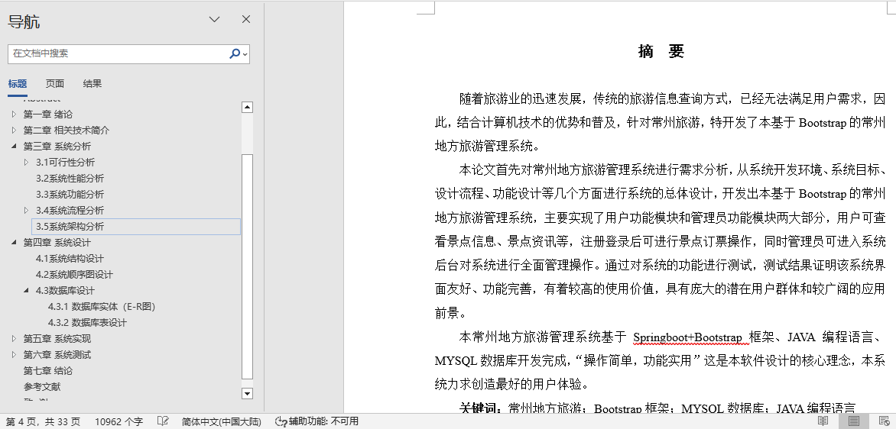
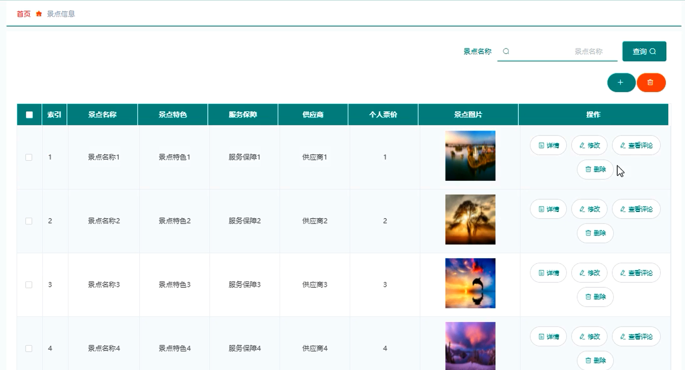
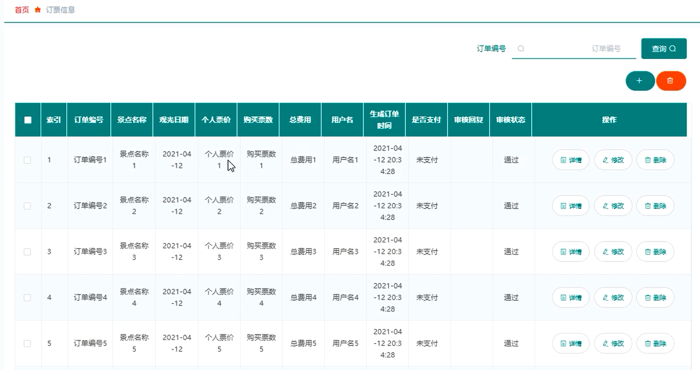
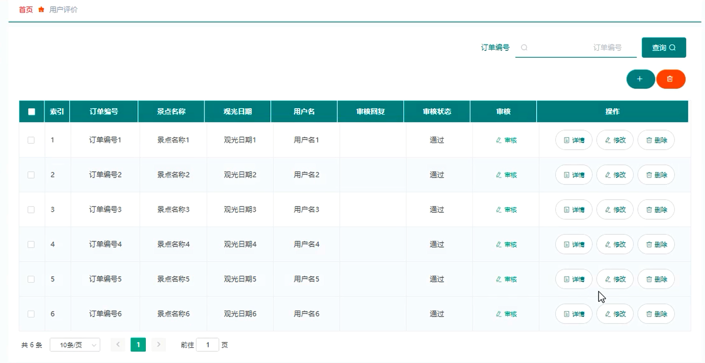
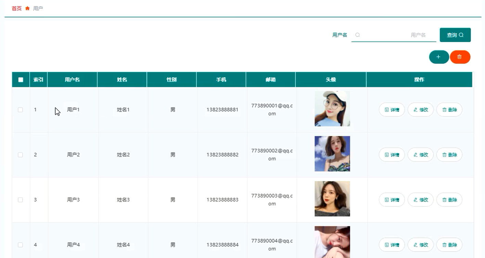
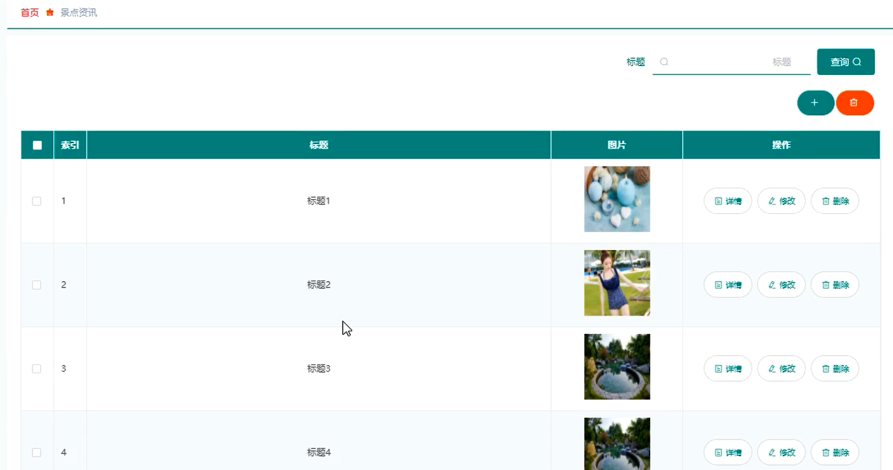
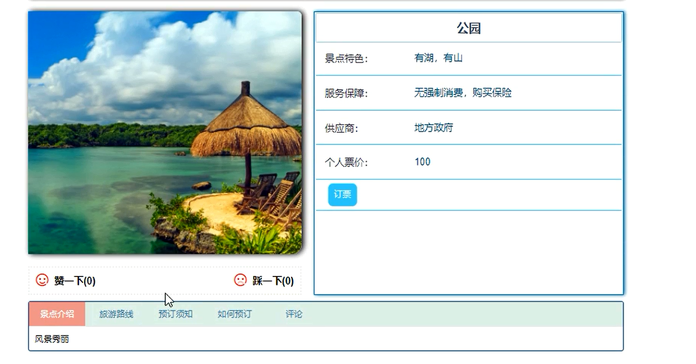

## 基于vue的旅游管理系统(程序+报告)

- <b>完整代码获取地址：从戎源码网 ([https://armycodes.com/](https://armycodes.com/))</b>
- <b>技术探讨、资料分享，请加QQ群：692619798</b> 
- <b>作者微信：19941326836  QQ：952045282</b> 
- <b>承接计算机毕业设计、Java毕业设计、Python毕业设计、深度学习、机器学习</b>
- <b>选题+开题报告+任务书+程序定制+安装调试+论文+答辩ppt 一条龙服务</b>
- <b>所有选题地址 ([https://github.com/YuLin-Coder/AllProjectCatalog](https://github.com/YuLin-Coder/AllProjectCatalog)) </b>

## 项目介绍
基于vue的旅游管理系统，系统包含两种角色：用户、管理员，系统分为前台和后台两大模块，主要功能如下：

1 登录模块的实现
用户需通过正确的用户名、密码和登录类型进行登录。系统以用户名、密码和登录类型为参数进行验证，信息正确则登录进入对应用户功能界面；否则，登录失败。

2 管理员功能模块的实现
- 景点信息管理: 管理员可添加、修改和删除景点信息。

- 订票信息管理: 管理员可查看所有订票信息，并进行修改和删除操作。

- 用户评价管理: 管理员可查看用户评价信息，并进行审核、修改和删除操作。

- 用户管理: 管理员可查看、添加、修改和删除用户信息。

- 景点资讯管理: 管理员可增删改查景点资讯信息。

3 用户功能模块的实现
- 系统主界面: 用户可以查看系统信息，包括网站首页、景点信息以及景点资讯。

- 用户注册: 未有账号的用户可进入注册界面进行注册操作。

- 景点信息详情: 用户可查看景点信息详情，并进行订票操作。

- 订票信息: 用户可查看个人订票信息，并选择进行支付或评价操作。

## 项目技术
- 编程语言：Java
- 数据库：MySQL
- 项目管理工具：Maven
- 前端技术：HTML、CSS、JavaScript、Vue
- 后端技术：Spring、SpringMVC、MyBatis

## 运行环境
- JDK版本：JDK1.8及以上
- 开发工具：IDEA、Ecplise、Myecplise都可以
- 数据库: MySQL5.7及以上
- Maven：maven3.0及以上
- Node：14.14.0及以上

## 运行截图

